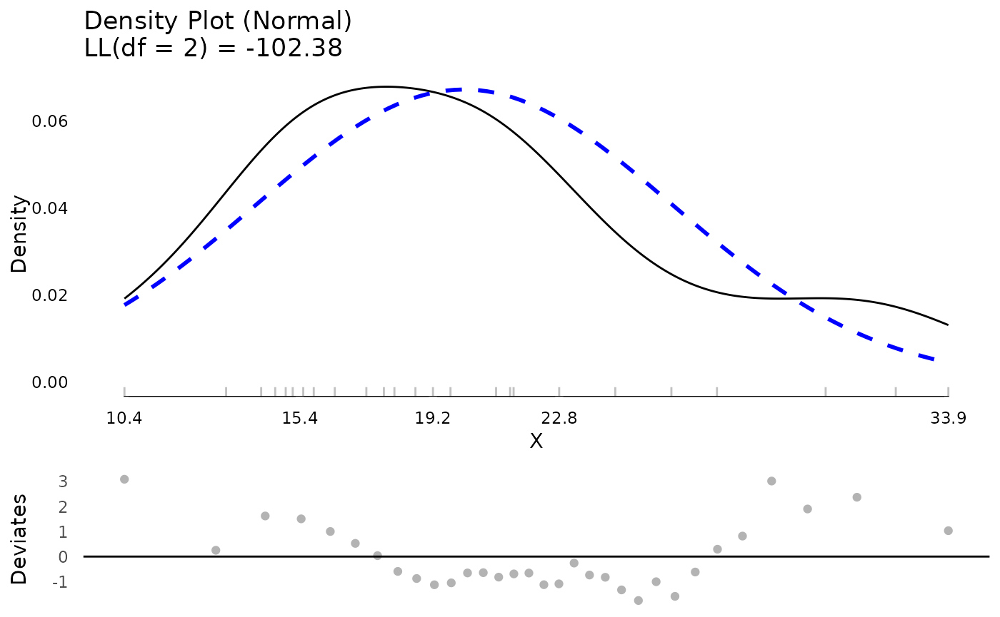
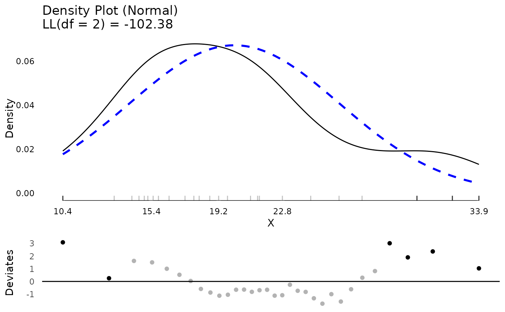
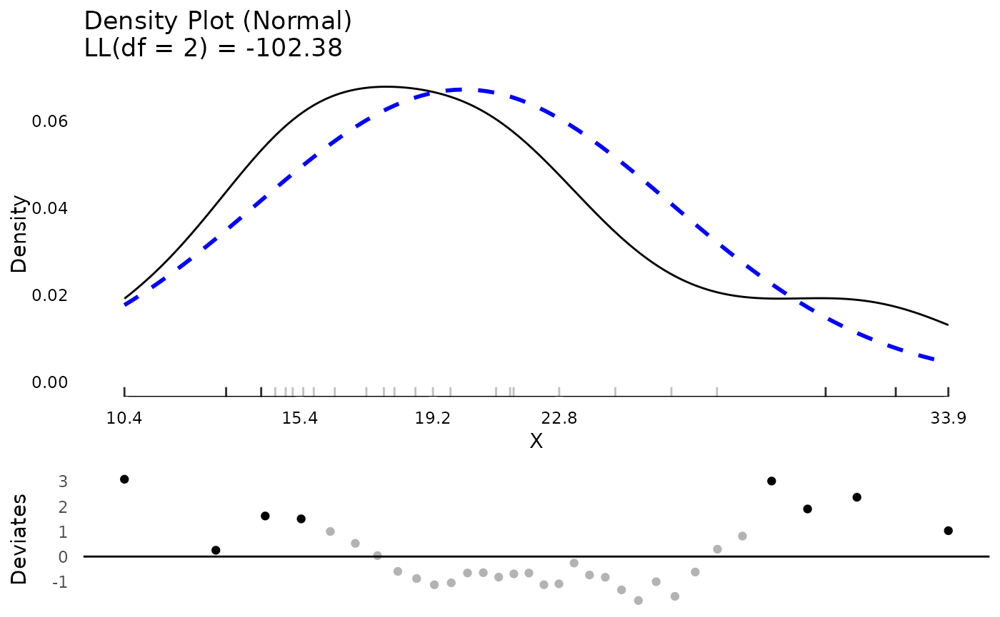
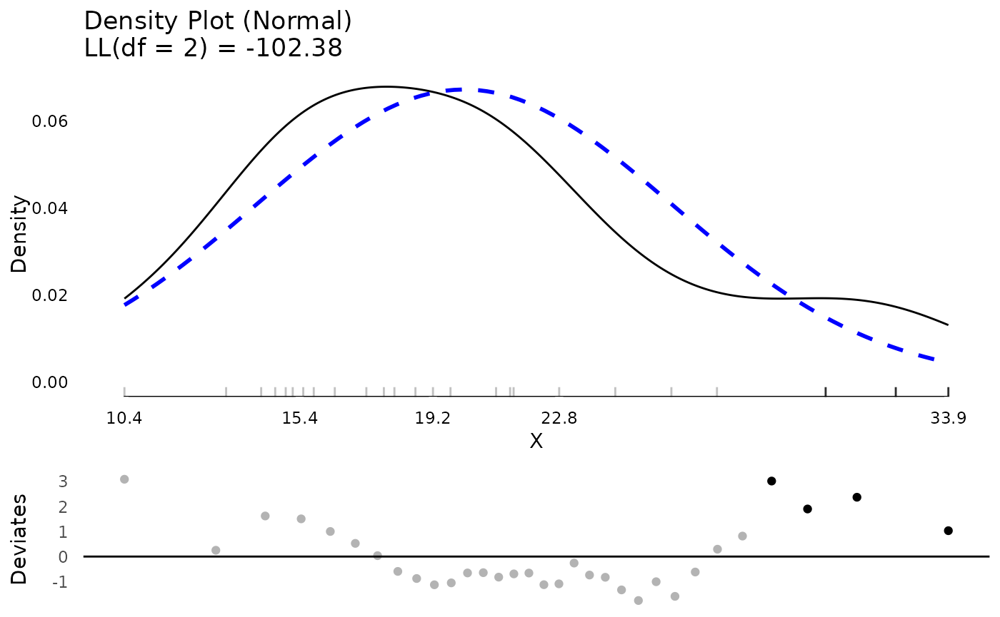
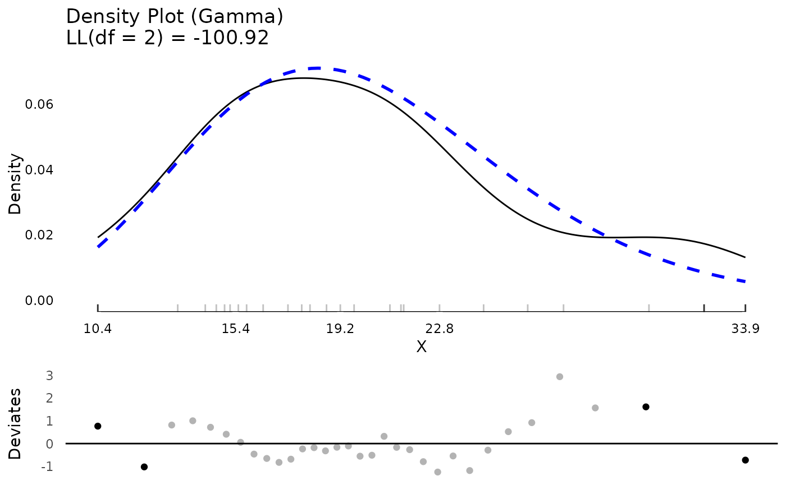
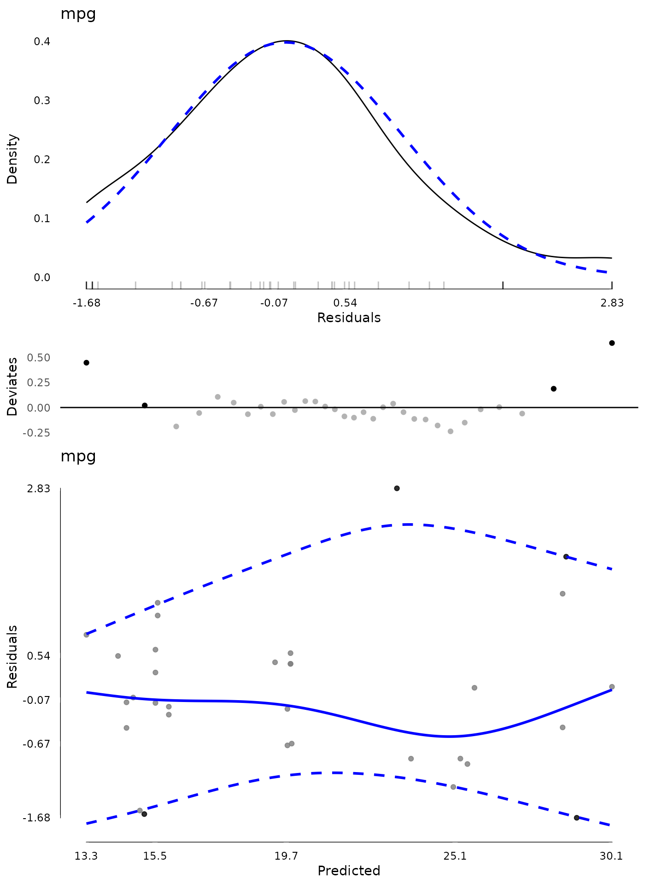
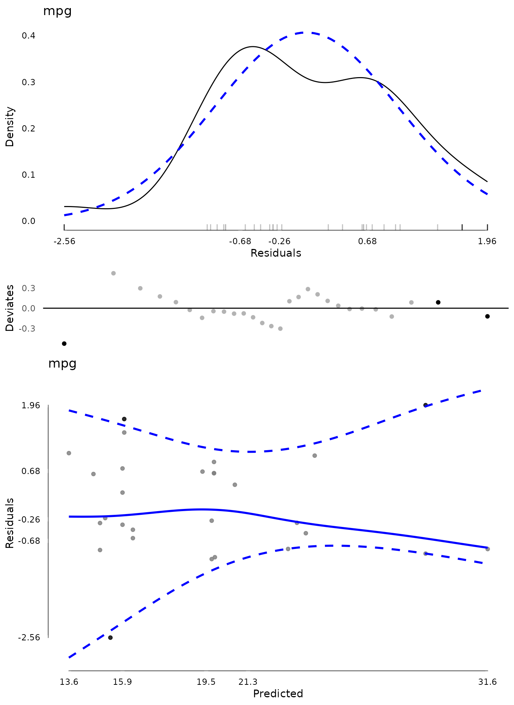

# Diagnostics

To start, load the package.

``` r

library(JWileymisc)
#> Registered S3 method overwritten by 'lme4':
#>   method           from
#>   na.action.merMod car
```

## Univariate Diagnostics

The
[`testDistribution()`](https://joshuawiley.com/JWileymisc/reference/testDistribution.md)
function can be used to evaluate whether a variable comes from a
specific, known parametric distribution. By default, no outliers or
“extreme values” are shown. These can be used directly through the data
output or plotted. The plot includes both the empirical density, the
density of the assumed parametric distribution, a rug plot showing
actual values, if not too many data points, and a Quantile-Quantile plot
(QQ Plot). The QQ Plot is rotated to save space, by removing the
diagonal and rotating to be horizontal, which we call a QQ Deviates
plot.

One other unique feature of the density plot is the x axis. It follows
Tufte’s principles about presenting data. To make the x axis more
informative, it is a “range frame”, meaning it is only plotted over the
range of the actual data. Secondly, the breaks are a five number summary
of the data. These five numbers are:

- Minimum (0th percentile)
- Lower quartile (25th percentile)
- Median (50th percentile)
- Upper quartile (75th percentile)
- Maximum (100th percentile)

Most plots use breaks that are evenly spaced. These do not convey
information about the data. Using a five number summary the breaks
themselves are effectively like a boxplot with specific values provided
so you can immediately read what values the min and max are, the median,
etc.

``` r


test <- testDistribution(mtcars$mpg, "normal")
head(test$Data)
#>            X     Y OriginalOrder   isEV YDeviates
#>        <num> <num>         <int> <fctr>     <num>
#> 1:  7.313777  10.4            15     No 3.0862233
#> 2: 10.148901  10.4            16     No 0.2510990
#> 3: 11.680210  13.3            24     No 1.6197895
#> 4: 12.795066  14.3             7     No 1.5049335
#> 5: 13.698771  14.7            17     No 1.0012292
#> 6: 14.474288  15.0            31     No 0.5257124
table(test$Data$isEV)
#> 
#>  No Yes 
#>  32   0

plot(test)
```



It is possible to have extreme values automatically identified either
based on a theoretical distribution or empirically identified (e.g., the
top or bottom XX percent are classified as extreme). We say that .10
(10%) of data points are “extreme” just to illustrate. Extreme values
are shown in black with non extreme values shown in light grey, both in
the rug plot and in the QQ plot. Although 10% is higher than typically
would be chosen, given the small dataset, it is necessary to have
extreme values at both ends of the distribution for illustration.

``` r

test <- testDistribution(mtcars$mpg, "normal",
                         extremevalues = "theoretical",
                         ev.perc = .10)
## view the data with extreme values
head(test$Data)
#>            X     Y OriginalOrder   isEV YDeviates
#>        <num> <num>         <int> <fctr>     <num>
#> 1:  7.313777  10.4            15    Yes 3.0862233
#> 2: 10.148901  10.4            16    Yes 0.2510990
#> 3: 11.680210  13.3            24     No 1.6197895
#> 4: 12.795066  14.3             7     No 1.5049335
#> 5: 13.698771  14.7            17     No 1.0012292
#> 6: 14.474288  15.0            31     No 0.5257124

## count how many extreme values there are
table(test$Data$isEV)
#> 
#>  No Yes 
#>  26   6

## plot the distribution
plot(test)
```



``` r


## show which values are extreme
test$Data[isEV == "Yes"]
#>            X     Y OriginalOrder   isEV YDeviates
#>        <num> <num>         <int> <fctr>     <num>
#> 1:  7.313777  10.4            15    Yes  3.086223
#> 2: 10.148901  10.4            16    Yes  0.251099
#> 3: 27.386184  30.4            19    Yes  3.013816
#> 4: 28.501040  30.4            28    Yes  1.898960
#> 5: 30.032349  32.4            18    Yes  2.367651
#> 6: 32.867473  33.9            20    Yes  1.032527

## view extreme values on mpg in the original dataset
## by use the original order, the original rows to select
## the correct rows from the original dataset
mtcars[test$Data[isEV == "Yes", OriginalOrder], ]
#>                      mpg cyl  disp  hp drat    wt  qsec vs am gear carb
#> Cadillac Fleetwood  10.4   8 472.0 205 2.93 5.250 17.98  0  0    3    4
#> Lincoln Continental 10.4   8 460.0 215 3.00 5.424 17.82  0  0    3    4
#> Honda Civic         30.4   4  75.7  52 4.93 1.615 18.52  1  1    4    2
#> Lotus Europa        30.4   4  95.1 113 3.77 1.513 16.90  1  1    5    2
#> Fiat 128            32.4   4  78.7  66 4.08 2.200 19.47  1  1    4    1
#> Toyota Corolla      33.9   4  71.1  65 4.22 1.835 19.90  1  1    4    1
```

Extreme values taken off the empirical percentiles can be chosen as
well.

``` r

test <- testDistribution(mtcars$mpg, "normal",
                         extremevalues = "empirical",
                         ev.perc = .10)
head(test$Data)
#>            X     Y OriginalOrder   isEV YDeviates
#>        <num> <num>         <int> <fctr>     <num>
#> 1:  7.313777  10.4            15    Yes 3.0862233
#> 2: 10.148901  10.4            16    Yes 0.2510990
#> 3: 11.680210  13.3            24    Yes 1.6197895
#> 4: 12.795066  14.3             7    Yes 1.5049335
#> 5: 13.698771  14.7            17     No 1.0012292
#> 6: 14.474288  15.0            31     No 0.5257124
table(test$Data$isEV)
#> 
#>  No Yes 
#>  24   8

plot(test)
```



Many distributions beyond normal are possible. These can be compared
visually or based on log likelihoods. Here we compare results between a
normal and gamma distribution. The log likelihood values show that the
`mpg` variable is better fit by the gamma distribution than the normal,
although they are quite close.

``` r

testN <- testDistribution(mtcars$mpg, "normal",
                          extremevalues = "theoretical",
                          ev.perc = .05)
testG <- testDistribution(mtcars$mpg, "gamma",
                          extremevalues = "theoretical",
                          ev.perc = .05)

## compare the log likelihood assuming a normal or gamma distribution
testN$Distribution$LL
#> 'log Lik.' -102.3778 (df=2)
testG$Distribution$LL
#> 'log Lik.' -100.9208 (df=2)

plot(testN)
```



``` r

plot(testG)
```



## Model Diagnostics

`JWileymisc` has features to support standard parametric model
diagnostics. The generic function
[`modelDiagnostics()`](https://joshuawiley.com/JWileymisc/reference/modelDiagnostics.md)
has a method implemented for linear models.

In the code that follows, we use the
[`modelDiagnostics()`](https://joshuawiley.com/JWileymisc/reference/modelDiagnostics.md)
function to calculate some diagnostics which are plotted using the
matching [`plot()`](https://rdrr.io/r/graphics/plot.default.html)
method. The result is a plot of the standardized residuals against the
expected (normal) distribution, the same QQ deviates plot we saw with
[`testDistribution()`](https://joshuawiley.com/JWileymisc/reference/testDistribution.md).
Together, these provide information about whether the model assumption
of normality is likely met, or not. In addition, block dots and the
black rug lines indicate relatively extreme residual values. The label
in the top left is the outcome variable name.

Another plot is a scatter plot of predicted values (x axis) against the
standardized residuals (y axis). Again a five number summary is used for
the x and y axis. To assess whether there are any systematic trends in
the residuals, a loess line is added as a solid blue line. To assess
heterogeneity/heteroscedasticity of residuals, quantile regression lines
are added as dashed blue lines. These lines are for the 10th and 90th
percentile of the distribution. Depending on the model and data, these
quantile regression lines may use smoothing splines to allow non-linear
patterns. For the assumption that residual variance is homogenous, you
would expect the two lines to be approximately parallel and flat, with
equal distance between them, across the range of predicted values.

**Note** it is uncommon to decide that 5 percent of values are extreme.
This high value was chosen to illustrate only. More common values in
practice are `ev.perc = .001`, `ev.perc = .005` or `ev.perc = .01`,
which capture 0.1%, 0.5%, and 1% of values, respectively. However, in
this small dataset, those would not give many “extreme values” for
illustration, so a higher value was used.

``` r


m <- lm(mpg ~ hp * factor(cyl), data = mtcars)

md <- modelDiagnostics(m, ev.perc = .05)

plot(md, ncol = 1)
```



Finally, given that there are a few extreme values, we may want to
identify and exclude them. We can view the extreme values. Here we
extract these by effect type and with the outcome score associated with
each. The index shows the index, from the residuals where the extreme
values occurred. Note that this may not match up to the original data if
there are missing values. In those cases, the easiest approach is to
remove missing values on model variables first, then fit the model and
then calculate diagnostics.

``` r

## show extreme values
md$extremeValues
#>      mpg Index EffectType
#>    <num> <int>     <char>
#> 1:  24.4     8  Residuals
#> 2:  10.4    15  Residuals
#> 3:  33.9    20  Residuals
#> 4:  30.4    28  Residuals

## show extreme values in overall dataset
mtcars[md$extremeValues$Index, 1:4]
#>                     mpg cyl  disp  hp
#> Merc 240D          24.4   4 146.7  62
#> Cadillac Fleetwood 10.4   8 472.0 205
#> Toyota Corolla     33.9   4  71.1  65
#> Lotus Europa       30.4   4  95.1 113
```

Using the extreme values index, we can exclude these and re-fit the
model to see if it changes. We can show a summary of coefficients from
each model and how much they change.

``` r


## exclude extreme values
m2 <- lm(mpg ~ hp * factor(cyl), data = mtcars[-md$extremeValues$Index, ])

## show a summary of coefficients from both models
## and the percent change
round(data.frame(
  M1 = coef(m),
  M2 = coef(m2),
  PercentChange = coef(m2) / coef(m) * 100 - 100), 2)
```

|                     | M1     | M2     | PercentChange |
|:--------------------|:-------|:-------|:--------------|
| **(Intercept)**     | 35.98  | 41.53  | 15.42         |
| **hp**              | -0.11  | -0.19  | 69.18         |
| **factor(cyl)6**    | -15.31 | -20.86 | 36.23         |
| **factor(cyl)8**    | -17.9  | -22.95 | 28.19         |
| **hp:factor(cyl)6** | 0.11   | 0.18   | 74.19         |
| **hp:factor(cyl)8** | 0.1    | 0.18   | 78.53         |

Once some values are removed, new values may be extreme. Although
additional passes are not that common, they can be done. In the
following code, we conduct new diagnostics on the model that had extreme
values from the first model removed.

``` r


## diagnostics after removing outliers from first model
md2 <- modelDiagnostics(m2, ev.perc = .05)

plot(md2, ask = FALSE, ncol = 1)
```



``` r


## show (new) extreme values
md2$extremeValues
#>      mpg Index EffectType
#>    <num> <int>     <char>
#> 1:  10.4    14  Residuals
#> 2:  32.4    16  Residuals
#> 3:  19.2    22  Residuals
```
