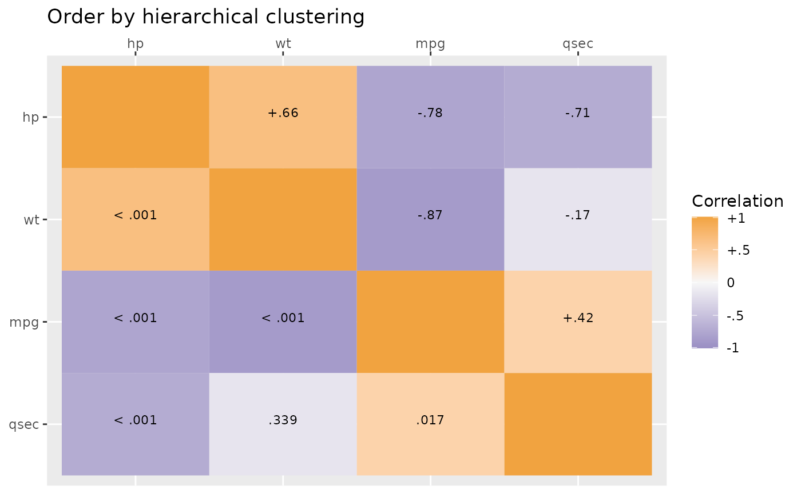
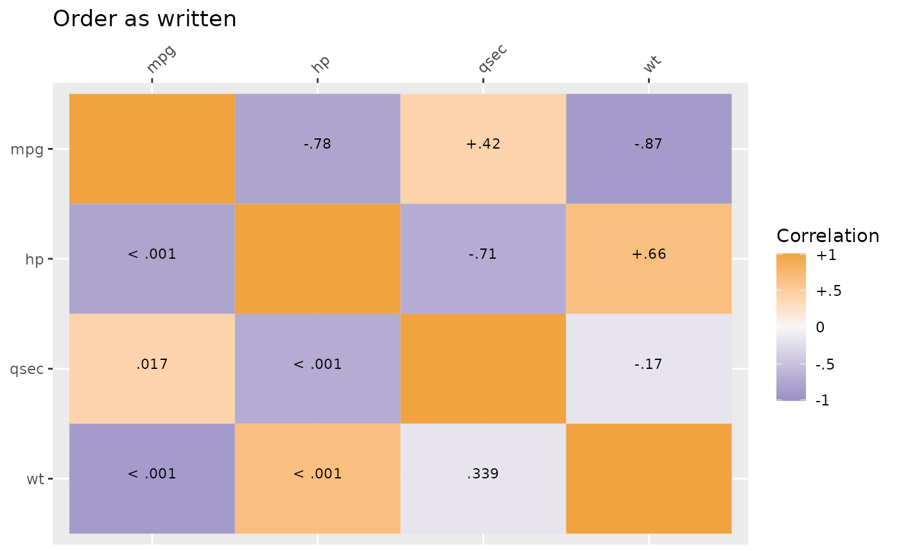
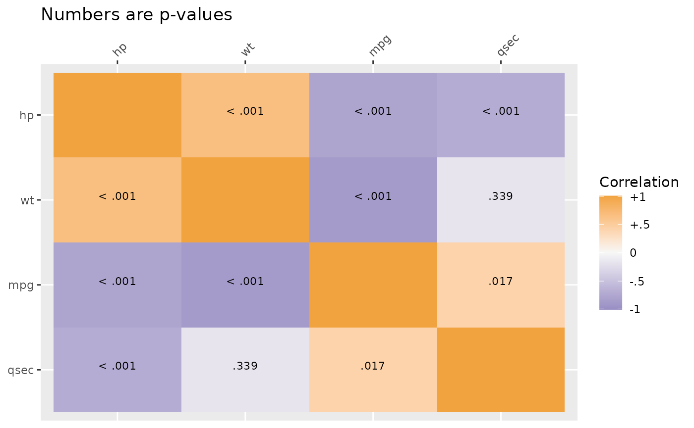
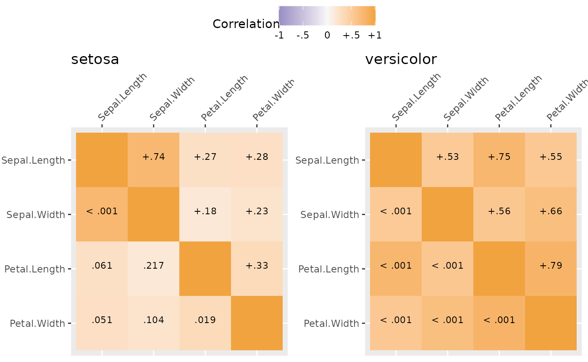
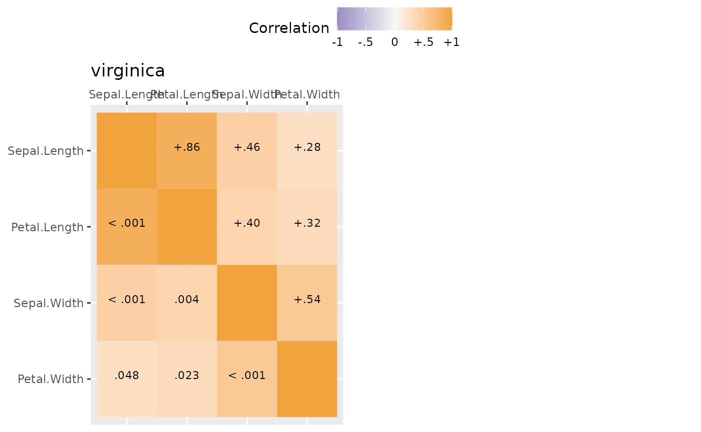
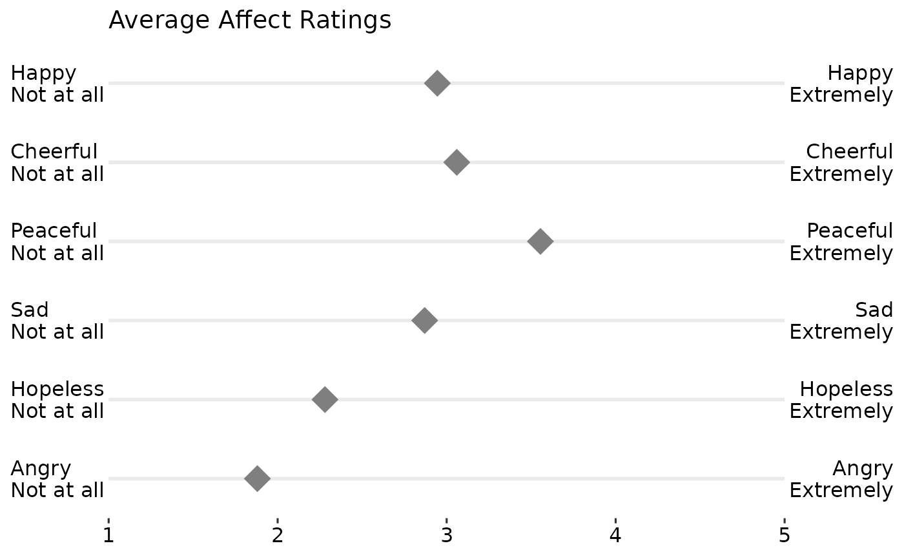
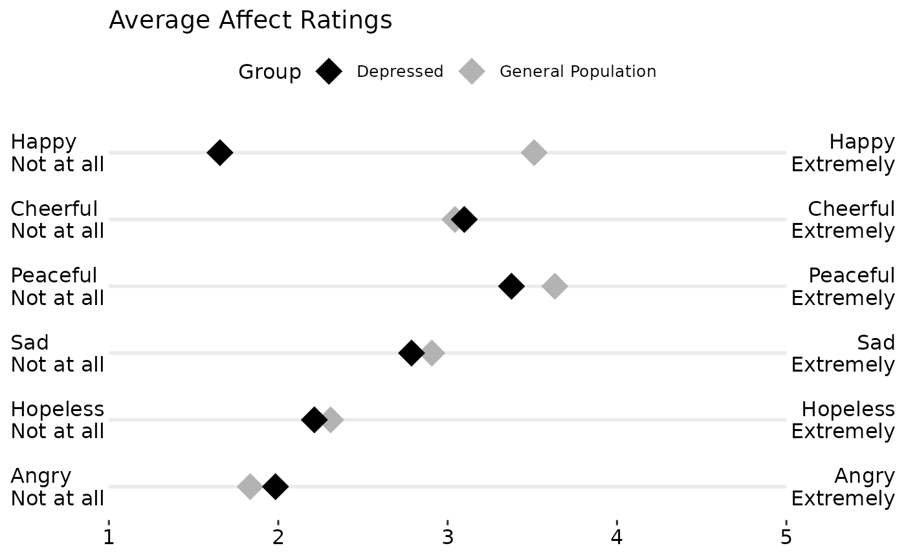

# Exploratory and Descriptive Statistics and Plots

To start, load the package.

``` r

library(JWileymisc)
#> Registered S3 method overwritten by 'lme4':
#>   method           from
#>   na.action.merMod car
library(ggplot2)
library(data.table)
#> 
#> Attaching package: 'data.table'
#> The following object is masked from 'package:base':
#> 
#>     %notin%
```

## Descriptive Statistics

The
[`egltable()`](https://joshuawiley.com/JWileymisc/reference/egltable.md)
function calculates basic descriptive statistics.

``` r


egltable(c("mpg", "hp", "qsec", "wt", "vs"),
         data = mtcars)
```

|      | M (SD)         |
|:-----|:---------------|
| mpg  | 20.09 (6.03)   |
| hp   | 146.69 (68.56) |
| qsec | 17.85 (1.79)   |
| wt   | 3.22 (0.98)    |
| vs   | 0.44 (0.50)    |

Example descriptive statistics table. {.table style="width:36%;"}

The `strict` argument can be used if variables are categorical but are
not coded as factors. In this case, `vs` has two levels: 0 and 1 and the
frequency and percentage of each are shown instead of the mean and
standard deviation.

``` r


egltable(c("mpg", "hp", "qsec", "wt", "vs"),
         data = mtcars, strict=FALSE)
```

|      | M (SD)/N (%)   |
|:-----|:---------------|
| mpg  | 20.09 (6.03)   |
| hp   | 146.69 (68.56) |
| qsec | 17.85 (1.79)   |
| wt   | 3.22 (0.98)    |
| vs   |                |
| 0    | 18 (56.2%)     |
| 1    | 14 (43.8%)     |

Example descriptive statistics table with automatic categorical
variables. {.table style="width:36%;"}

[`egltable()`](https://joshuawiley.com/JWileymisc/reference/egltable.md)
also allows descriptive statistics to be broken down by another variable
by using the `g` argument. This not only separates results by group but
also calculates bivariate tests of the differences between groups and
effect sizes. For example, t-tests for continuous variables and two
groups or chi-square tests for categorical variables. For more than two
groups, ANOVAs are used.

``` r


egltable(c("mpg", "hp", "qsec", "wt", "vs"), 
  g = "am", data = mtcars, strict = FALSE)
```

|   | 0 M (SD)/N (%) | 1 M (SD)/N (%) | Test |
|:---|:---|:---|:---|
| mpg | 17.15 (3.83) | 24.39 (6.17) | t(df=30) = -4.11, p \< .001, d = 1.48 |
| hp | 160.26 (53.91) | 126.85 (84.06) | t(df=30) = 1.37, p = .180, d = 0.49 |
| qsec | 18.18 (1.75) | 17.36 (1.79) | t(df=30) = 1.29, p = .206, d = 0.47 |
| wt | 3.77 (0.78) | 2.41 (0.62) | t(df=30) = 5.26, p \< .001, d = 1.89 |
| vs |  |  | Chi-square = 0.91, df = 1, p = .341, Phi = 0.17 |
| 0 | 12 (63.2%) | 6 (46.2%) |  |
| 1 | 7 (36.8%) | 7 (53.8%) |  |

Example descriptive statistics table by group. {.table}

For very skewed continuous variables, non-parametric statistics and
tests may be more appropriate. These can be generated using the
`parametric` argument. For chi-square tests with small cell sizes,
simulated p-values also can be generated.

``` r


egltable(c("mpg", "hp", "qsec", "wt", "vs"), 
         g = "am", data = mtcars, strict = FALSE,
         parametric = FALSE)
```

|   | 0 Mdn (IQR)/N (%) | 1 Mdn (IQR)/N (%) | Test |
|:---|:---|:---|:---|
| mpg | 17.30 (4.25) | 22.80 (9.40) | KW chi-square = 9.79, df = 1, p = .002 |
| hp | 175.00 (76.00) | 109.00 (47.00) | KW chi-square = 4.07, df = 1, p = .044 |
| qsec | 17.82 (2.00) | 17.02 (2.15) | KW chi-square = 1.28, df = 1, p = .258 |
| wt | 3.52 (0.41) | 2.32 (0.84) | KW chi-square = 16.87, df = 1, p \< .001 |
| vs |  |  | Chi-square = 0.91, df = 1, p = .341, Phi = 0.17 |
| 0 | 12 (63.2%) | 6 (46.2%) |  |
| 1 | 7 (36.8%) | 7 (53.8%) |  |

Example descriptive statistics table by group. {.table}

### Paired Data

We have already seen how to compare descriptives across groups when the
groups were independent.
[`egltable()`](https://joshuawiley.com/JWileymisc/reference/egltable.md)
also supports using groups to test paired samples. To use this, the
variable passed to the grouping argument, `g` must have exactly two
levels and you must also pass a variable that is a unique ID per unit
and specify `paired = TRUE`.

By default for continuous, paired data, mean and standard deviations are
presented and a paired samples t-test is used. A pseudo Cohen’s d effect
size is calculated as the mean of the change score divided by the
standard deviation of the change score. If there are missing data, its
possible that the mean difference will be different than the difference
in means as the means are calculated on all available data, but the
effect size can only be calculated on complete cases.

``` r

## example with paired data
egltable(
  vars = "extra",
  g = "group",
  data = sleep,
  idvar = "ID",
  paired = TRUE)
```

|       | 1 M (SD)    | 2 M (SD)    | Test                               |
|:------|:------------|:------------|:-----------------------------------|
| extra | 0.75 (1.79) | 2.33 (2.00) | t(df=9) = 4.06, p = .003, d = 1.28 |

Example parametric descriptive statistics for paired data. {.table
style="width:96%;"}

If we do not want to make parametric assumptions with continuous
variables, we can set `parametric = FALSE`. In this case the
descriptives are medians and a paired Wilcoxon test is used. In this
dataset there are ties and a warning is generated about ties and zeroes.
This warning is generally ignorable, but if these were central
hypothesis tests, it may warrant further testing using, for example,
simulations which are more precise in the case of ties.

``` r

egltable(
  vars = "extra",
  g = "group",
  data = sleep,
  idvar = "ID",
  paired = TRUE,
  parametric = FALSE)
```

|       | 1 Mdn (IQR) | 2 Mdn (IQR) | Test                                |
|:------|:------------|:------------|:------------------------------------|
| extra | 0.35 (1.88) | 1.75 (3.28) | Wilcoxon Paired V = 54.00, p = .004 |

Example non parametric descriptive statistics for paired data. {.table
style="width:97%;"}

We can also work with categorical paired data. The following code
creates a categorical variable, the tertiles of chick weights measured
over time. The chick weight dataset has many time points, but we will
just use two.

``` r


## paired categorical data example
## using data on chick weights to create categorical data
tmp <- subset(ChickWeight, Time %in% c(0, 20))
tmp$WeightTertile <- cut(tmp$weight,
  breaks = quantile(tmp$weight, c(0, 1/3, 2/3, 1), na.rm = TRUE),
  include.lowest = TRUE)
```

No special code is needed to work with categorical variables.
[`egltable()`](https://joshuawiley.com/JWileymisc/reference/egltable.md)
recognises categorical variables and uses McNemar’s test, which is a
chi-square of the off diagonals, which tests whether people (or chicks
in this case) change groups equally over time or preferentially move one
direction. In this case, a significant result suggests that over time
chicks’ weights change preferentially one way and the descriptive
statistics show us that there is an increase in weight tertile from time
0 to time 20.

``` r

egltable(c("weight", "WeightTertile"), g = "Time",
  data = tmp,
  idvar = "Chick", paired = TRUE)
```

|   | 0 M (SD)/N (%) | 20 M (SD)/N (%) | Test |
|:---|:---|:---|:---|
| weight | 41.06 (1.13) | 209.72 (66.51) | t(df=45) = 17.10, p \< .001, d = 2.52 |
| WeightTertile |  |  | McNemar’s Chi-square = 39.00, df = 3, p \< .001 |
| \[39,41.7\] | 32 (64.0%) | 0 (0.0%) |  |
| (41.7,169\] | 18 (36.0%) | 14 (30.4%) |  |
| (169,361\] | 0 (0.0%) | 32 (69.6%) |  |

Continuous and categorical paired data. {.table}

## Correlation Summaries

For continuous variables, correlation matrices are commonly examined.
This is especially true for structural equation models or path analyses.

The
[`SEMSummary()`](https://joshuawiley.com/JWileymisc/reference/SEMSummary.md)
function provides a simple way to generate these under various options.
There is a formula interface, similar to
[`lm()`](https://rdrr.io/r/stats/lm.html) or other regression models.
Missing data can be handled using listwise deletion, pairwise present
data, or full information maximum likelihood (FIML). When assumptions
are met, FIML is less biased and uses all available data, and is the
default.

``` r


m <- SEMSummary(~ mpg + hp + qsec + wt, data = mtcars)

corTab <- APAStyler(m, type = "cor", stars = TRUE)
#>         N  M      SD    1.  2.       3.       4.      
#> 1. mpg  32  20.09  6.03  -  -0.78***  0.42*   -0.87***
#> 2. hp   32 146.69 68.56      -       -0.71***  0.66***
#> 3. qsec 32  17.85  1.79               -       -0.17   
#> 4. wt   32   3.22  0.98                        -      
#> 
#> Percentage of coverage for each pairwise covariance or correlation
#> 
#>      mpg hp qsec wt
#> mpg  1   1  1    1 
#> hp       1  1    1 
#> qsec        1    1 
#> wt               1
```

These correlations can be nicely formatted into a table.

|             | N   | M      | SD    | 1\. | 2\.         | 3\.         | 4\.         |
|:------------|:----|:-------|:------|:----|:------------|:------------|:------------|
| **1. mpg**  | 32  | 20.09  | 6.03  | \-  | -0.78\*\*\* | 0.42\*      | -0.87\*\*\* |
| **2. hp**   | 32  | 146.69 | 68.56 |     | \-          | -0.71\*\*\* | 0.66\*\*\*  |
| **3. qsec** | 32  | 17.85  | 1.79  |     |             | \-          | -0.17       |
| **4. wt**   | 32  | 3.22   | 0.98  |     |             |             | \-          |

Example correlation table. {.table}

Plot methods exist for
[`SEMSummary()`](https://joshuawiley.com/JWileymisc/reference/SEMSummary.md)
objects. By default, above the diagonal are correlations and below the
diagonal are p-values. However, the type argument can be set (see
[`?corplot`](https://joshuawiley.com/JWileymisc/reference/corplot.md))
to get all values to be either correlations or p-values. By default,
another useful feature is that hierarchical clustering is used to group
similar variables together in clusters, provided a more useful sorting
of the data than many “default” correlation matrices. If a specific
order is desired, you can use the `order = "asis"` option to keep the
variable order the same as written in
[`SEMSummary()`](https://joshuawiley.com/JWileymisc/reference/SEMSummary.md).

``` r


plot(m) +
  ggtitle("Order by hierarchical clustering")
```



``` r


plot(m, order = "asis") +
  ggtitle("Order as written")
```



``` r


plot(m, type = "p") +
  ggtitle("Numbers are p-values")
```



### Grouped Correlations

Correlations also can be broken down by group. Here results are
separated by species which are automaticaly used as the title of each
graph.

``` r


mg <- SEMSummary(~ Sepal.Length + Petal.Length +
                  Sepal.Width + Petal.Width | Species,
                 data = iris)

plot(mg)
#> $`1`
```



    #> 
    #> $`2`



    #> 
    #> attr(,"class")
    #> [1] "list"      "ggarrange"

## Likert Scale Plots

In much of psychological and consumer/market research, likert rating
scales are used. For example, rating a question/item from “Strongly
DISagree” to “Strongly Agree” or rating satisfaction from “Not at all”
to “Very Satisfied” or adjectives that capture mood/affect from “Not at
all” to “Extremely”. Likert plots aim to show these results clearly and
aid interpretation by presenting the anchors as well.

The following code creates some simulated data, summarizes it, adds the
necessary labels/anchors, and creates a nice plot.

``` r


## simulate some likert style data
set.seed(1234)
d <- data.table(
  Happy = sample(1:5, 200, TRUE, c(.1, .2, .4, .2, .1)),
  Cheerful = sample(1:5, 200, TRUE, c(.1, .2, .2, .4, .1)),
  Peaceful = sample(1:5, 200, TRUE, c(.1, .1, .2, .4, .2)),
  Sad = sample(1:5, 200, TRUE, c(.1, .3, .3, .2, .1)),
  Hopeless = sample(1:5, 200, TRUE, c(.3, .3, .2, .2, 0)),  
  Angry = sample(1:5, 200, TRUE, c(.4, .3, .2, .08, .02)))

dmeans <- melt(d, measure.vars = names(d))[,
  .(Mean = mean(value, na.rm = TRUE)), by = variable]

dmeans[, Low := paste0(variable, "\nNot at all")]
dmeans[, High := paste0(variable, "\nExtremely")]
dmeans[, variable := as.integer(factor(variable))]

## view the summarised data
print(dmeans)
#>    variable  Mean                  Low                High
#>       <int> <num>               <char>              <char>
#> 1:        1 2.945    Happy\nNot at all    Happy\nExtremely
#> 2:        2 3.060 Cheerful\nNot at all Cheerful\nExtremely
#> 3:        3 3.555 Peaceful\nNot at all Peaceful\nExtremely
#> 4:        4 2.870      Sad\nNot at all      Sad\nExtremely
#> 5:        5 2.280 Hopeless\nNot at all Hopeless\nExtremely
#> 6:        6 1.880    Angry\nNot at all    Angry\nExtremely

gglikert("Mean", "variable", "Low", "High", data = dmeans,
         xlim = c(1, 5),
         title = "Average Affect Ratings")
```



``` r


## create a grouping variable
dg <- cbind(d, Group = ifelse(
                 d$Happy > mean(d$Happy, na.rm = TRUE),
                 "General Population", "Depressed"))

dgmeans <- melt(dg, measure.vars = names(d), id.vars = "Group")[,
  .(Mean = mean(value, na.rm = TRUE)), by = .(variable, Group)]

dgmeans[, Low := paste0(variable, "\nNot at all")]
dgmeans[, High := paste0(variable, "\nExtremely")]
dgmeans[, variable := as.integer(factor(variable))]

## view the summarised data
print(dgmeans)
#>     variable              Group     Mean                  Low
#>        <int>             <char>    <num>               <char>
#>  1:        1 General Population 3.510791    Happy\nNot at all
#>  2:        1          Depressed 1.655738    Happy\nNot at all
#>  3:        2 General Population 3.043165 Cheerful\nNot at all
#>  4:        2          Depressed 3.098361 Cheerful\nNot at all
#>  5:        3 General Population 3.633094 Peaceful\nNot at all
#>  6:        3          Depressed 3.377049 Peaceful\nNot at all
#>  7:        4 General Population 2.906475      Sad\nNot at all
#>  8:        4          Depressed 2.786885      Sad\nNot at all
#>  9:        5 General Population 2.309353 Hopeless\nNot at all
#> 10:        5          Depressed 2.213115 Hopeless\nNot at all
#> 11:        6 General Population 1.834532    Angry\nNot at all
#> 12:        6          Depressed 1.983607    Angry\nNot at all
#>                    High
#>                  <char>
#>  1:    Happy\nExtremely
#>  2:    Happy\nExtremely
#>  3: Cheerful\nExtremely
#>  4: Cheerful\nExtremely
#>  5: Peaceful\nExtremely
#>  6: Peaceful\nExtremely
#>  7:      Sad\nExtremely
#>  8:      Sad\nExtremely
#>  9: Hopeless\nExtremely
#> 10: Hopeless\nExtremely
#> 11:    Angry\nExtremely
#> 12:    Angry\nExtremely

gglikert("Mean", "variable", "Low", "High",
         colour = "Group",
         data = dgmeans,
         xlim = c(1, 5),
         title = "Average Affect Ratings") +
  scale_colour_manual(
    values = c("Depressed" = "black",
               "General Population" = "grey70"))
```


